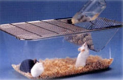

## Principle
 

&nbsp;

In experimental immunology and biomedical research, the importance of laboratory animals is indisputable. Their care and handling is a contributing factor to the quality of the science resulting from their use. This is true when animals are used as a source of biological materials (cells, antibodies, and serum) for laboratory use or as experimental subjects.  Animal research is best served by a coordinated, multidisciplinary approach that addresses program management, ethics of animal experimentation, animal environmental maintenance, and sound animal research methodology.

&nbsp;

When handling mice it is advisable to wear gloves to prevent the allergies that may develop due to the direct contact with animal allergen. Mice are usually caught and lifted by the tail. The tail should be grasped between its midpoint and the mouse's body. The tail may be grasped with the thumb and forefinger or by the use of smooth-tipped forceps. With this simple method of holding, they may be transferred to another cage, or a balance, identified and examined casually and  sex may be determined (all procedures benefit from training with an experienced animal technician). There are a number of factors that affect the condition of a lab animal (here we use the example of a rodent). The environment where a laboratory animal is housed has a major impact on the animal's health and response to experimental manipulation. Variations in the environment and infectious agents can seriously alter immunological function. Details like caging (minimum space requirements should be looked at), feed (standardized diets), bedding (the surface on which the animal moves around in the cage), water (continuous access to fresh uncontaminated water), sanitation (to minimize the impact of environmental contamination), environmental monitoring (monitoring controlled temperature, humidity, ventilation, and illumination, etc) and their maintenance; should be looked at to ensure animal health and minimize variable experimental parameters.

&nbsp;

 

Anesthetic agents are used in laboratory animals to prevent pain or distress due to an experimental procedure or for restraint to facilitate a technically difficult procedure. Agents may be used alone or in combination to achieve the desired effect. Anaesthesia, analgesia, sedation, and tranquilization are achieved through drug selection and proper dosing. Investigators using anesthetic agents should familiarize themselves with their physiologic effects and the risks involved with their use. The appropriate use of analgesics, tranquilizers, and anesthetic agents to prevent pain, distress, and suffering in research animals is mandated by Public Law 89-544 (Animal Welfare Act) and its amendments, PHS policy, and institutional policies.

&nbsp;

 

The intensity and duration of an animal's response to anesthetic agents is affected by species, age, genetic background, health or nutritional status, environmental conditions, and route of administration. The route of administration is largely determined by the formulation of the agent and the recommendations found on the package insert. If the formulation allows for multiple routes of administration, the choice is generally based on the species and desired duration of effect. The most commonly used route in rodent species is intraperitoneal injection because it is technically simple and results in generally safe and uniform absorption with minimal and predictable periods of induction and recovery. In mice,the intramuscular route is difficult to achieve due to the small muscle mass available, and frequently results in unpredictable induction times, duration periods, and intensity of effect. The intravenous route requires technical expertise and skill, but has very rapid induction and recovery phases. However, dosages must be carefully calculated to ensure adequate anaesthesia without overdose. Subcutaneous injection of anaesthesia, while very safe, results in nonuniform or poor absorption and quite unpredictable levels of anaesthesia. Because of the small size of rodent species, most injectable agents should be diluted 5- to 10-fold to enable accurate dosing.

&nbsp;

&nbsp;

Various inhalant anesthetics are available for animals but most are unsuitable for rodents. The most commonly used agents include methoxyflurane, ether, and isoflurane. Methoxyflurane is generally the safest and most convenient for use with rodents. Ether and isoflurane are not recommended for general use in rodents. Ether is both flammable and explosive. Safe handling and storage are a constant concern. Additionally, ether is highly irritating to the respiratory tract and excess respiratory tract secretions can be troublesome for the animal during its use. Physicochemical characteristics of isoflurane make it difficult to administer. Because isoflurane easily reaches lethal concentrations at room temperature, a sophisticated and calibrated vaporizer is needed for its use. But, using very small amounts of isoflurane reduces the danger. We can calculate the amount to be used if we know the volume of the anaesthesia chamber being used. Multiply the volume by 0.15-0.2ml to obtain the volume, in ml, of Isoflurane to be used. Therefore a 1.5L container requires between 0.225 and 0.3 ml of isoflurane.

&nbsp;

 

### Critical Parameters

&nbsp;

 

Risk is inherent with all methods of anaesthesia in all species, but is particularly significant when anesthetizing small laboratory species. Methods used in larger animals to reduce the risk of anesthetization-e.g., endotracheal intubation, sophisticated cardiopulmonary monitoring, and systemic support through indwelling catheters and respiratory support- are often impractical, inefficient, or nearly impossible in rodents. Anesthetic risk can be reduced by proper selection of an anesthetic agent appropriate for the species, careful titration of dosage and monitoring of the desired effect, and use of an appropriate route of administration. Dosage titration should begin at the low end of the range suggested. Small rodents have a high ratio of body surface area to weight, which favors heat loss. Anesthetized or recovering animals should be kept warm (lukewarm) with heat lamps, commercially available water circulating heating pads, or other devices. In addition, attention should be given to keeping the animal's airway clear of debris. Gentle extension of the chin and neck will help overcome respiratory difficulties. Recovering animals should also be turned from side to side every 5 to 10 min to assist circulation and speed recovery. Finally, animals should be observed until recovery is nearly complete and animals are able to maintain sternal recumbency or move about without falling.

&nbsp;

 

### Blood Collection
 

&nbsp;

Blood is the most frequently sampled body fluid for evaluation of serum antibodies or analysis of surface markers on peripheral blood cells. Here we describe a few basic blood collection methodologies commonly when working on rodents. Blood collection is the most common interventional procedure. Selection of an appropriate method will depend on the species, amount of blood needed, frequency of sampling, and whether the animal's survival is required. Here we mention techniques which involve usage of microhematocrit tubes, syringes, etc.

&nbsp;

 

With appropriate techniques, small amounts of blood can be obtained with little ill effect on the animal. Use of anesthetics is recommended for some of the protocols. Anesthetics may alter some hematological and biochemical parameters, but their use is indicated to prevent undue stress. When necessary, anticoagulants may be used to prevent clotting.
